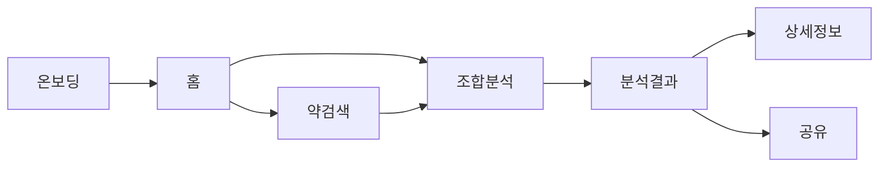
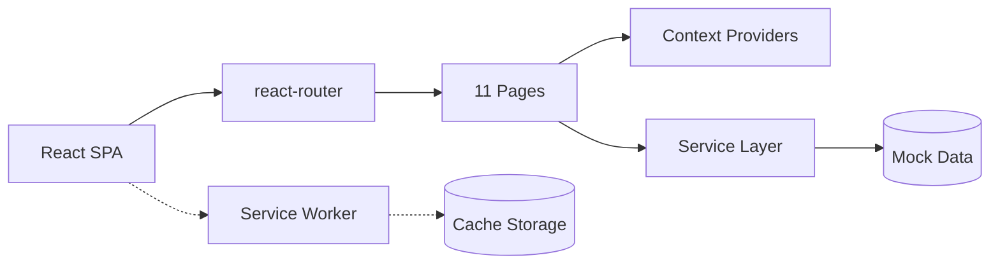

# 약 조심

> **먹으려는 약이 안전한지, 바로 확인하는 복약 안전 가이드**
> 약, 음식, 영양제 조합의 상호작용 위험도를 쉬운 말로 안내해요.


---

## 목차

- [이 앱은 무엇인가요?](#이-앱은-무엇인가요)
- [누구를 위한 앱인가요?](#누구를-위한-앱인가요)
- [주요 기능](#주요-기능)
- [사용자 흐름](#사용자-흐름)
- [Tech Stack](#tech-stack)
- [시스템 구조](#시스템-구조)
- [프로젝트 구조](#프로젝트-구조)
- [라우팅](#라우팅)
- [디자인 시스템](#디자인-시스템)
- [개발 시작하기](#개발-시작하기)
- [주요 명령어](#주요-명령어)

---

## 이 앱은 무엇인가요?

약 조심은 복용 중인 약, 함께 먹는 음식, 영양제 사이의 상호작용 위험을 확인하는 웹 앱이에요.
약학정보원과 식약처 DUR 데이터를 기반으로, 금기/주의/확인 정보 없음 3단계로 결과를 안내해요.

비회원으로 바로 이용할 수 있고, 결과를 이미지나 PDF로 저장하거나 공유할 수 있어요.

## 누구를 위한 앱인가요?

| 사용자 | 시나리오 |
| ------ | -------- |
| 다약제 복용 환자 | 여러 약을 함께 먹어도 되는지 빠르게 확인 |
| 고령 환자 및 보호자 | 고령층 모드로 글씨/터치 영역을 키워 쉽게 이용 |
| 건강 관심 일반인 | 영양제와 약의 조합이 안전한지 확인 |
| 약사/의료 종사자 | 환자 상담 시 빠른 상호작용 조회 참고 |

## 주요 기능

| 기능 | 설명 |
| ---- | ---- |
| 약 검색 | 약품명, 제조사, 성분명으로 약을 찾아요 (Mock 데이터 기반) |
| 처방전 촬영 | 처방전 사진으로 약을 인식하고 추가해요 (OCR) |
| 조합 분석 | 약 + 음식 + 영양제 조합의 상호작용을 분석해요 |
| 위험도 안내 | 금기/주의/확인 정보 없음 3단계로 결과를 보여줘요 |
| 결과 저장 및 공유 | 이미지, PDF로 저장하거나 텍스트로 공유해요 |
| 고령층 모드 | 글꼴과 터치 영역을 키워 접근성을 높여요 |
| 반응형 | 모바일(375px+) + 데스크톱(1024px+) 2단 레이아웃 |
| PWA | 홈화면 설치, 오프라인 캐시 지원 |

## 사용자 흐름



---

## Tech Stack

| 계층 | 기술 |
| ---- | ---- |
| 프레임워크 | React 18, TypeScript, Vite 6 |
| 라우팅 | react-router 7 (lazy loading + Suspense) |
| 스타일링 | Tailwind CSS 4, OKLCH 색상 시스템, CSS Variables |
| UI 컴포넌트 | Radix UI + shadcn/ui 패턴 |
| 애니메이션 | motion (Framer Motion), CSS keyframes |
| 상태 관리 | React Context + useReducer (User, Medicine, Analysis) |
| 아이콘 | lucide-react |
| 알림 | sonner (toast) |
| 빌드 | Vite + @tailwindcss/vite + @vitejs/plugin-react |

## 시스템 구조



현재 모든 데이터는 Mock 기반이에요. 백엔드 API 연동 시 `src/services/` 레이어만 교체하면 돼요.

## 프로젝트 구조

```text
src/
  App.tsx                        # 라우팅 + 프로바이더 구성
  routes.ts                      # 라우트 상수 + 헬퍼 함수
  main.tsx                       # 앱 엔트리 + PWA 등록
  app/components/ui/             # shadcn/ui 기반 프리미티브
  components/
    common/                      # RiskBadge, SearchInput, MedicineCard 등
    layout/                      # PageContainer, AppHeader, BottomNav, DesktopSidebar
  contexts/                      # UserContext, MedicineContext, AnalysisContext
  hooks/                         # useMedicineSearch, useAnalysis, useDebounce
  mock/                          # 약, 음식, 영양제, 상호작용 목 데이터
  pages/                         # 11개 페이지 컴포넌트
  services/                      # analysisService, medicineService, ocrService
  styles/
    fonts.css                    # AritaDotumKR 폰트 정의
    theme.css                    # OKLCH 색상 + 타이포그래피 토큰
    globals.css                  # 3계층 디자인 토큰 + 그림자 + 애니메이션
    index.css                    # 스타일 엔트리
    tailwind.css                 # Tailwind 설정
  types/                         # Medicine, Analysis, User 타입
  utils/                         # risk, share 유틸리티
public/
  fonts/                         # AritaDotumKR woff2
  manifest.json                  # PWA 매니페스트
  sw.js                          # 서비스 워커
  favicon.svg                    # 앱 아이콘
```

## 라우팅

```text
/onboarding              온보딩 (공개)
── OnboardingGuard ────────────────
/                        홈
/search                  약 검색
/search/add              약 추가
/search/ocr              처방전 촬영
/analyze                 조합 선택
/analyze/results         분석 결과
/analyze/detail/:id      상세 정보
/analyze/share/:id       결과 공유
/settings                설정
*                        404
```

모든 보호 라우트는 온보딩 완료 후 접근할 수 있어요. 라우트 상수는 `src/routes.ts`에서 중앙 관리해요.

## 디자인 시스템

| 요소 | 접근 방식 |
| ---- | --------- |
| 색상 | OKLCH 색공간 기반, 3계층 토큰 (Base → Semantic → Component) |
| 서피스 | 테두리 대신 다층 그림자로 깊이 표현 (`surface-card`, `surface-elevated`) |
| 헤더 | Frosted glass 효과 (`glass` 클래스) |
| 타이포 | AritaDotumKR 전용, 7단계 스케일 |
| 애니메이션 | Spring 이징 (`--ease-spring`), staggered reveal |
| 반응형 | 모바일 하단 탭 + 데스크톱 좌측 사이드바 (1024px 분기) |
| 접근성 | 고령층 모드, 이중 인코딩 (색상 + 아이콘 + 텍스트) |

---

## 개발 시작하기

```bash
pnpm install
pnpm dev
```

Node.js 20 이상, pnpm 9 이상이 필요해요.

## 주요 명령어

| 명령어 | 설명 |
| ------ | ---- |
| `pnpm dev` | 개발 서버 실행 |
| `pnpm build` | 프로덕션 빌드 |
| `pnpm lint` | ESLint 검사 |
| `pnpm lint:fix` | ESLint 자동 수정 |

## 참고

- 실제 서비스에서는 약학정보원/식약처 API를 연동해요.
- 이 앱은 의료 진단을 대체하지 않아요. 복약 관련 결정은 반드시 의사/약사와 상담해 주세요.
- 데이터 출처: 약학정보원, 식품의약품안전처 DUR
