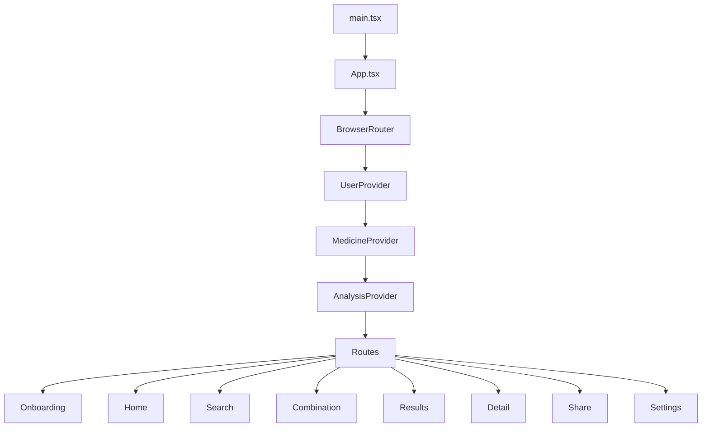
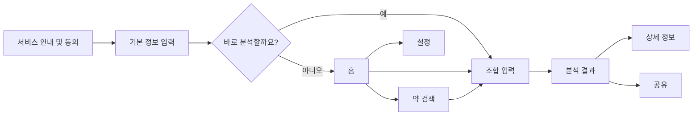
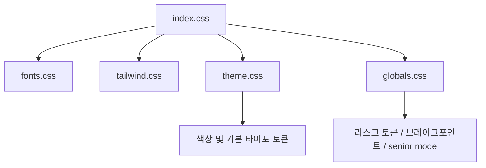

# Project Overview

## 한눈에 보기

- 프로젝트명: Medication Interaction Guide App
- 목적: 약, 음식, 영양제 간 상호작용을 모바일 중심 UX로 안내
- 현재 성격: 경진대회 제출을 목표로 서비스 방향과 사용자 흐름을 정리 중인 구현 단계 프로젝트
- 최신 기능 기준: `docs/specs/functional-spec-v2.md`

## 실행 방법

이 저장소는 `pnpm-lock.yaml`이 있으므로 `pnpm` 기준으로 실행하는 것을 권장한다.

### 요구 사항

- Node.js 20 이상 권장
- pnpm 설치 필요

### 개발 서버 실행

```bash
pnpm install
pnpm dev
```

기본적으로 Vite 개발 서버가 실행된다.

### 프로덕션 빌드

```bash
pnpm build
```

### ESLint 실행

```bash
pnpm lint
```

### 참고

- `package.json`에는 현재 `dev`, `build`, `lint`, `lint:fix` 스크립트가 정의되어 있다.
- `preview`, `test` 스크립트는 아직 없다.

## 기술 스택

### 핵심 프레임워크

- React
- TypeScript
- Vite

### 스타일링

- Tailwind CSS v4
- CSS variables 기반 테마 토큰
- 프로젝트 커스텀 CSS 파일 병행 사용

### 라우팅

- `react-router`

### UI 기본 라이브러리

- Radix UI 계열 primitive 다수 사용
- shadcn 스타일의 `src/app/components/ui/*` 래퍼 컴포넌트 사용
- 아이콘은 `lucide-react`

### 현재 `package.json` 기준 눈에 띄는 라이브러리

- 폼: `react-hook-form`
- 모션: `motion`
- 클래스 유틸: `clsx`, `class-variance-authority`, `tailwind-merge`
- MUI 관련 패키지 존재: `@mui/material`, `@mui/icons-material`
- Emotion 관련 패키지 존재: `@emotion/react`, `@emotion/styled`

### 주의

- 설치된 라이브러리 수는 많지만, 실제 이 앱 코드에서 지금 적극적으로 보이는 핵심은 `React + react-router + Tailwind + Radix/shadcn 스타일 UI + lucide-react` 조합이다.
- 즉 "설치되어 있음"과 "현재 화면에서 실사용 중"은 구분해서 이해해야 한다.

## 현재 실행 구조




## 주요 사용자 흐름




## 현재 파일 구조

```text
src/
  App.tsx
  main.tsx
  app/components/ui/         # 버튼, 다이얼로그, 탭 등 UI primitive 래퍼
  components/
    common/                  # SearchInput, RiskBadge, SectionCard 등 공통 조합 컴포넌트
    layout/                  # AppHeader, BottomNav, PageContainer
  contexts/                  # User, Medicine, Analysis 전역 상태
  hooks/                     # 검색, 분석 등 화면용 커스텀 훅
  mock/                      # 음식, 영양제, 의약품, 상호작용 목업 데이터
  pages/                     # 라우트 단위 페이지
  services/                  # 분석/OCR/의약품 검색 서비스 레이어
  styles/                    # fonts, globals, tailwind, theme, index
  types/                     # 도메인 타입 정의
```

## 디렉터리 역할 설명

### `src/pages`

- 사용자가 직접 보게 되는 화면 단위 컴포넌트
- 현재는 페이지가 기능 로직과 UI를 같이 들고 있는 편

### `src/components/common`

- 여러 페이지에서 재사용 가능한 공통 표시 컴포넌트
- `RiskBadge`, `SectionCard`, `MedicineCard`가 여기에 있다

### `src/components/layout`

- 공통 레이아웃 셸
- 헤더, 하단 네비, 페이지 컨테이너 관리

### `src/contexts`

- React Context 기반 앱 상태 관리
- 전역 상태 라이브러리 대신 Context + useReducer 구조
- 현재 기준으로는 비회원 세션 상태와 분석 흐름 상태 정리에 집중해야 한다.

### `src/services`

- 데이터 가공 또는 비동기 처리 레이어
- 아직은 mock 기반/프로토타입 성격이 강하다

### `src/mock`

- 실제 API 대신 화면을 움직이게 하는 샘플 데이터
- 저장 기록, 회원 데이터 등 구형 가정이 섞여 있으면 정리 대상이다.

## 스타일 구조




## 지금 코드 기준으로 이해해야 할 포인트

### 1. `PageContainer`가 사실상 화면 공통 프레임

- 헤더와 하단 네비를 여기서 붙인다
- UX/UI 작업 대부분은 여기 규칙을 건드릴 가능성이 높다

### 2. `UserContext`가 개인화와 접근성 토글을 들고 있음

- 온보딩 완료 여부
- 고령층 모드 상태
- 초기 입력 정보와 비회원 세션 정보

### 3. `AnalysisContext`와 `MedicineContext`가 핵심 플로우 상태를 나눠 관리

- 약 선택
- 분석 세션 결과
- 상세 페이지/공유 페이지 데이터 출처
- `약 검색 -> 분석 -> 결과` 흐름에 맞는 상태만 남기고 정리할 필요가 있다

## 개발자가 보면 좋은 읽는 순서

1. `src/App.tsx`
2. `src/components/layout/PageContainer.tsx`
3. `src/pages/HomePage.tsx`
4. `src/pages/SearchPage.tsx`
5. `src/pages/CombinationPage.tsx`
6. `src/pages/ResultsPage.tsx`
7. `src/contexts/*`
8. `src/styles/theme.css`, `src/styles/globals.css`

## 지금 바로 개선하기 좋은 첫 작업

1. `seniorMode`를 실제 루트 DOM에 연결
2. 홈 검색창 제거 및 랜딩형 홈 재구성
3. 분석 화면을 비회원 조합 입력 중심으로 정리
4. 결과 화면을 `금기/주의/확인 정보 없음` 기준으로 단순화
