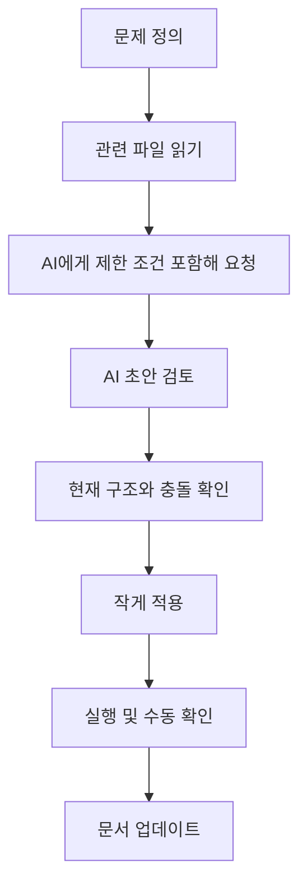

# AI Collaboration Guide

이 문서는 개발자가 ChatGPT, Claude, Codex 같은 AI를 활용해 이 프로젝트를 개선할 때 품질이 무너지지 않도록 돕기 위한 작업 가이드다.

## 기본 원칙

- AI는 초안 작성 도구이지 최종 책임자가 아니다.
- UI가 예뻐 보인다고 좋은 UX가 되는 것은 아니다.
- 의료/안전 정보 앱이므로 "즉시 이해됨"이 "화려함"보다 우선이다.
- AI가 제안한 구조는 반드시 현재 코드 구조와 충돌 여부를 확인해야 한다.

## AI에게 맡기기 좋은 일

- 화면 개선 아이디어 초안 만들기
- 사용자 흐름 정리
- 컴포넌트 리팩터링 초안 만들기
- 반복되는 Tailwind 클래스 정리 제안
- 문서화 초안 작성
- 접근성 체크리스트 초안 작성

## AI에게 그대로 맡기면 위험한 일

- 의료적 문구 확정
- 실제 데이터 정확성 판단
- 라이브러리 도입 필요성 최종 판단
- 코드베이스 전체 리팩터링을 한 번에 맡기는 일
- 기존 구조를 이해하지 않은 상태에서 "예쁘게 바꾸기"

## AI 사용 작업 순서



## 좋은 프롬프트 예시

### 예시 1. 공통 하단 CTA 리팩터링

```text
이 프로젝트는 React + TypeScript + Tailwind + react-router 구조입니다.
현재 SearchPage와 CombinationPage에서 fixed bottom CTA 패턴이 중복됩니다.
기존 디자인 언어를 크게 깨지 않고 공통 BottomActionBar 컴포넌트로 정리하고 싶습니다.
조건:
1. 모바일 기준으로 하단 네비와 겹치지 않아야 합니다.
2. PageContainer와 충돌하지 않아야 합니다.
3. 접근성을 해치지 않아야 합니다.
4. 과도한 추상화는 피해주세요.
관련 파일:
- src/components/layout/PageContainer.tsx
- src/pages/SearchPage.tsx
- src/pages/CombinationPage.tsx
리팩터링 방향과 코드 초안을 제안해주세요.
```

### 예시 2. 결과 화면 UX 개선

```text
이 프로젝트의 ResultsPage UX를 개선하고 싶습니다.
의료 안전 정보 앱이라서 가장 위험한 정보를 먼저 보여주는 것이 중요합니다.
현재 구조를 유지하되,
1. critical/high 결과를 더 먼저 인지하게 만들고
2. 저장/공유보다 행동 유도를 더 분명하게 하며
3. 모바일 한 화면에서 정보 우선순위가 드러나게
개선안을 제안해주세요.
관련 파일:
- src/pages/ResultsPage.tsx
- src/components/common/RiskBadge.tsx
과한 신규 라이브러리 도입은 제외해주세요.
```

## 나쁜 프롬프트 예시

- "전체 UI 예쁘게 바꿔줘"
- "최신 트렌드처럼 만들어줘"
- "코드 다 리팩터링해줘"
- "이 파일들 알아서 고쳐줘"

이런 요청은 AI가 현재 구조를 무시하고 과한 추상화, 불필요한 라이브러리 추가, 시각적 일관성 붕괴를 만들 확률이 높다.

## AI에게 반드시 같이 알려줘야 하는 정보

- 현재 기준 명세서 경로: `docs/specs/functional-spec-v2.md`
- 현재 기술 스택
- 유지해야 할 컴포넌트 구조
- 수정 가능한 파일 범위
- 절대 깨지면 안 되는 UX 조건
- 모바일 우선 여부
- 접근성 요구사항
- 의료 안전 정보 앱이라는 맥락

## 코드 생성 후 검증 체크리스트

### 구조

- 기존 `PageContainer`, `SectionCard`, `RiskBadge`와 역할이 겹치지 않는가
- 같은 문제를 푸는 새 컴포넌트를 불필요하게 또 만들지 않았는가
- Context 구조를 불필요하게 복잡하게 만들지 않았는가

### UI

- 모바일에서 하단 CTA가 내용과 겹치지 않는가
- 버튼 우선순위가 명확한가
- 빈 상태, 로딩 상태, 오류 상태가 있는가
- 긴 한글 문장이 줄바꿈될 때 깨지지 않는가

### 접근성

- 클릭 가능한 영역이 충분히 큰가
- 색만으로 의미를 전달하지 않는가
- 키보드 포커스 이동이 가능한가
- 다이얼로그 열고 닫을 때 포커스가 자연스러운가

### 코드 품질

- props 이름이 역할을 설명하는가
- 중복 Tailwind 클래스가 너무 많지 않은가
- 한 컴포넌트가 데이터/상태/UI를 과하게 모두 들고 있지 않은가

## AI 출력물을 그대로 믿지 말아야 하는 징후

- 현재 파일에 없는 라이브러리를 당연한 듯 추가함
- 기존 상태 구조를 무시하고 전역 상태를 새로 도입함
- "간단하게"라면서 파일 수를 크게 늘림
- Tailwind와 CSS variable 체계를 무시하고 인라인 스타일을 남발함
- 의료 안전 문구를 단정적으로 바꿈

## 팀 작업용 짧은 규칙

- 한 번에 하나의 UX 문제만 AI에 맡긴다.
- 항상 관련 파일 경로를 같이 준다.
- AI가 만든 초안은 작은 단위로만 반영한다.
- 반영 후에는 반드시 실제 화면에서 확인한다.
- 끝나면 문서도 같이 업데이트한다.

## 추천 작업 루틴

1. `docs/specs/functional-spec-v2.md`에서 현재 범위 확인
2. 관련 파일 직접 읽기
3. AI에게 제한 조건과 파일 경로 포함해서 요청
4. 초안 중 필요한 부분만 수용
5. 직접 실행해 모바일 화면 확인
6. 핸드오프 문서 업데이트
